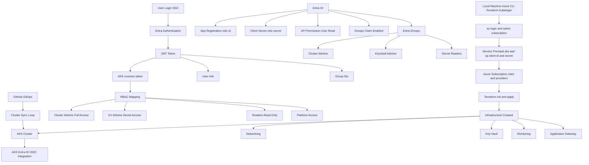
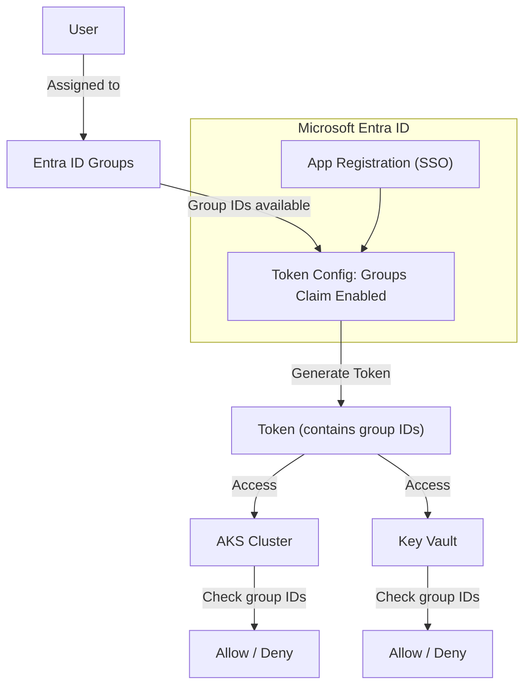

```mermaid
flowchart TD

A[Local Machine Azure CLI Terraform Kubelogin]
  --> B[az login and select subscription]

B --> C[Service Principal aks aad sp client id and secret]
C --> D[Azure Subscription roles and providers]

D --> E[Terraform init and apply]

E --> F[Infrastructure Created]

F --> F1[AKS Cluster]
F --> F2[Networking]
F --> F3[Key Vault]
F --> F4[Monitoring]
F --> F5[Application Gateway]

G[Entra ID]

G --> G1[App Registration oidc id]
G --> G2[Client Secret oidc secret]
G --> G3[API Permission User Read]
G --> G4[Groups Claim Enabled]

G --> G5[Entra Groups]
G5 --> G51[Cluster Admins]
G5 --> G52[KeyVault Admins]
G5 --> G53[Secret Readers]

F1 --> H[AKS Entra ID OIDC Integration]

I[User Login SSO] --> J[Entra Authentication]

J --> K[JWT Token]

K --> K1[User Info]
K --> K2[Group IDs]

K --> L[AKS receives token]

L --> M[RBAC Mapping]

M --> M1[Cluster Admins Full Access]
M --> M2[KV Admins Secret Access]
M --> M3[Readers Read Only]

M --> N[Platform Access]

O[GitHub GitOps]

O --> P[Cluster Sync Loop]
P --> F1
```

```mermaid
flowchart TD

%% Step 1: Define Groups
User[User] -->|Assigned to| Groups["Entra ID Groups"]
subgraph Entra["Microsoft Entra ID"]
    AppReg["App Registration (SSO)"]
    Config["Token Config: Groups Claim Enabled"]
end

%% Token creation
Groups -->|Group IDs available| Config
AppReg --> Config
Config -->|Generate Token| Token["Token (contains group IDs)"]

%% Step 3: Usage
Token -->|Access| AKS["AKS Cluster"]
Token -->|Access| KV["Key Vault"]

%% Authorization
AKS -->|Check group IDs| Decision1[Allow / Deny]
KV -->|Check group IDs| Decision2[Allow / Deny]
```